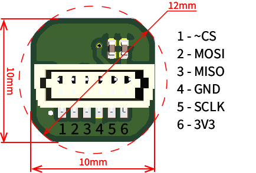

# PySPI
Sample code for python SPI encoder communication using Raspberry Pi. The sample is specifically built to work with Westwood Robotics MPS encoders, but feel free to modify it to fit other SPI encoders.

## Device
The pinout and dimentions of the Westwood Robotics MPS encoder is as shown below:



Connect the pins accordingly to your Pi, or any compatible device of your choice.

## Usage
Add these files into your project and just simply put```from MPS import *```at the beging of your code and you are good to use this package. Refer to 'sensor_orientation_update.py' and 'simple_read.py' as some sample usage.

Enjoy!
